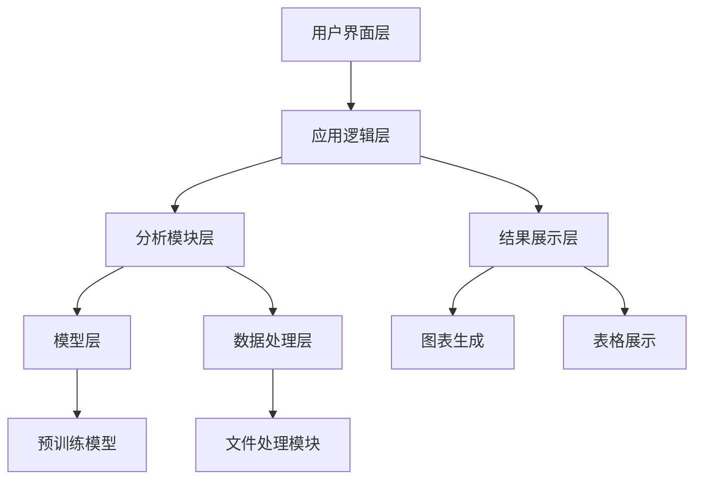

# 建筑业ESG报告披露质量评估系统

## 项目概述

建筑业ESG报告披露质量评估系统是一个基于人工智能和自然语言处理技术的综合评估平台，用于分析和评估建筑行业企业发布的环境、社会和治理（ESG）报告的披露质量。系统通过多个维度对ESG报告进行全面分析，帮助企业和投资者了解报告的完整性、实质性、可比性、可读性、可靠性和平衡性。

## 系统功能

### 1. 完整性分析
评估ESG报告内容的全面性和完整性，包括：
- 检查ESG报告是否包含所有必要的章节和内容
- 分析报告结构的合理性
- 评估信息披露的全面性

### 2. 实质性分析
评估ESG报告内容的重要性和相关性，包括：
- 识别报告中披露的实质性ESG事项
- 分析各ESG维度的重要性分布
- 评估实质性事项的披露深度

### 3. 可比性分析
评估不同年份ESG报告的一致性和可比性：
- 分析相邻年份报告内容的相似度
- 评估报告结构和指标的一致性
- 识别报告内容的变化趋势

### 4. 可读性分析
评估ESG报告的易读性和可理解性：
- 分析报告的语言复杂度
- 评估报告的结构清晰度
- 统计图表和可视化元素的使用情况
- 分析专业术语的使用频率和解释程度

### 5. 可靠性分析
评估ESG报告内容的可信度和可靠性：
- 检查报告是否经过外部鉴证
- 分析利益相关方参与情况
- 评估报告中的数据来源和真实性承诺

### 6. 平衡性分析
评估ESG报告的客观性和平衡性：
- 分析报告的情感倾向
- 评估正面和负面信息的披露平衡
- 检查报告的客观性和中立性

## 技术架构

### 系统架构


### 核心组件

1. **用户界面层**
   - 基于Streamlit的Web界面
   - 文件上传功能
   - 分析参数设置
   - 结果可视化展示
   - 实时进度显示与文件处理信息反馈

2. **应用逻辑层**
   - 分析流程控制
   - 结果整合与计算
   - 异常处理
   - 进度管理与状态更新

3. **分析模块层**
   - 完整性分析模块
   - 实质性分析模块
   - 可比性分析模块
   - 可读性分析模块
   - 可靠性分析模块
   - 平衡性分析模块

4. **模型层**
   - 情感分析模型
   - 文本分类模型
   - 文本嵌入模型
   - 相似度计算模型

5. **数据处理层**
   - PDF文件处理（支持加密文档）
   - TXT文件处理
   - 文本预处理
   - 数据提取与转换

## 安装和运行

### 环境要求
- Python 3.9+
- 依赖项如 `requirements.txt` 中所列

### 安装步骤

1. 克隆或下载项目到本地目录
2. 创建虚拟环境（可选但推荐）
   ```bash
   python -m venv venv
   ```
3. 激活虚拟环境
   ```bash
   # Windows
   venv\Scripts\activate
   # Linux/Mac
   source venv/bin/activate
   ```
4. 安装依赖项
   ```bash
   pip install -r requirements.txt
   ```

### 运行系统

```bash
streamlit run main.py
```

运行后，系统会在浏览器中打开，默认地址为：http://localhost:8501

## 使用说明

### 1. 文件准备

准备ESG报告文件：
- **汇总1/**：放置PDF格式的ESG报告（用于可读性分析）
- **汇总/**：放置TXT格式的ESG报告（用于其他维度分析）

系统会自动从这两个文件夹读取文件进行分析。

### 2. 权重设置（可选）

在左侧边栏设置分析权重，调整各分析维度的重要性：
- 完整性分析权重
- 实质性分析权重

### 3. 开始分析

点击"开始分析"按钮重新分析文件，系统会自动进行以下操作：
1. 对PDF文件进行可读性分析
2. 对TXT文件进行其他维度分析
3. 生成综合分析结果

分析过程中会显示实时进度条和当前处理的文件名（显示为"增长分析文件: [文件名]"）。

### 4. 查看结果

分析完成后，可以在以下区域查看结果：
- **分析结果图表**：通过展开面板查看各维度的分析图表
- **综合评分结果**：通过展开面板查看详细的评分表格

## 项目结构

```
├── main.py                          # 主Streamlit应用
├── integrated_analysis.py            # 综合分析模块
├── requirements.txt                 # 项目依赖
├── README.md                        # 项目说明文档
├── 汇总/                             # TXT格式ESG报告
├── 汇总1/                            # PDF格式ESG报告
├── 综合评价结果/                      # 分析结果输出目录
├── 历史分析记录/                      # 历史分析记录
├── esg_model/                        # ESG分析模型
├── models--hfl--chinese-bert-wwm/    # 中文BERT基础模型
│   └── snapshots/ab0aa81da273504efc8540aa4d0bbaa3016a1bb5/
├── results/                          # 完整性分析模型
│   └── checkpoint-1425/              # 完整性分析检查点
├── results1/                         # 实质性分析模型
│   └── checkpoint-3186/              # 实质性分析检查点
├── results2/                         # 可比性分析模型
│   └── checkpoint-582/               # 可比性分析检查点
└── venv39/                           # 虚拟环境
```

## 输出结果

系统分析完成后，会在`综合评价结果`目录下生成以下文件：

1. **combined_analysis_results.csv**：综合分析结果
2. **comparability_results.csv**：可比性分析结果
3. **readability.csv**：可读性分析结果
4. **reliability.csv**：可靠性分析结果
5. **sentiment_analysis_results.csv**：情感分析结果
6. **substantive_analysis_results.csv**：实质性分析结果

## 依赖项

主要依赖项包括：

- **Streamlit**：Web应用框架
- **Pandas**：数据处理和分析
- **NumPy**：数值计算
- **Matplotlib**：图表生成
- **Seaborn**：统计图表可视化
- **PyPDF2**：PDF文件处理
- **PyMuPDF**：PDF文本提取
- **python-docx**：Word文件处理
- **Transformers**：自然语言处理模型
- **SentenceTransformers**：文本嵌入模型
- **Torch**：深度学习框架

详细依赖信息请参考 `requirements.txt` 文件。

## 联系方式

如有问题或建议，请联系项目维护团队。

---

**版本**：1.2.0
**更新日期**：2025-12-29
**版权所有**：建筑业ESG报告质量评估研究团队

## 更新日志

### v1.2.0 (2025-12-29)
- 清理项目结构，移除多余的模型检查点和缓存文件
- 优化了项目文件组织，保留核心功能所需的最小文件集
- 更新了README文档，清晰说明项目结构和依赖关系
- 项目现已准备好上传到GitHub

### v1.1.0 (2025-01-08)
- 改进了用户界面，添加了可折叠的使用说明和系统功能面板
- 优化了进度条显示，添加了更清晰的文件处理状态提示
- 更新了文件处理信息显示，将"正在处理"改为"增长分析文件"
- 完善了项目文档，更新了项目结构和使用说明
- 修复了PDF处理相关的依赖问题